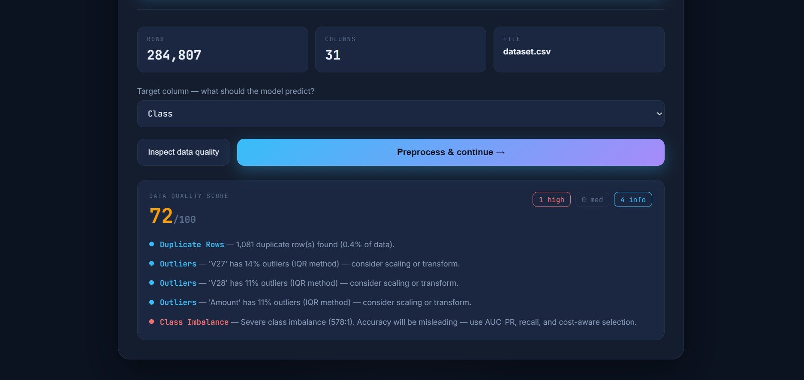
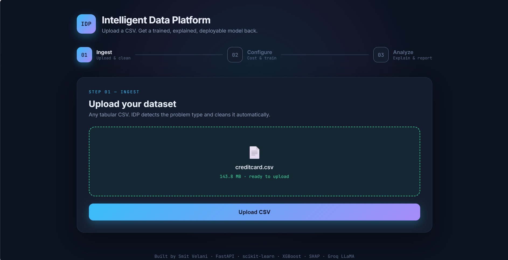
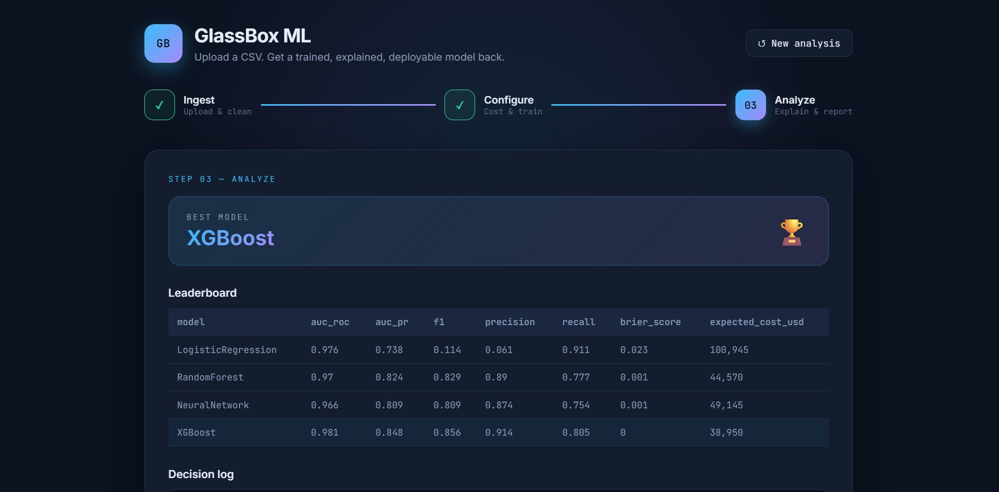
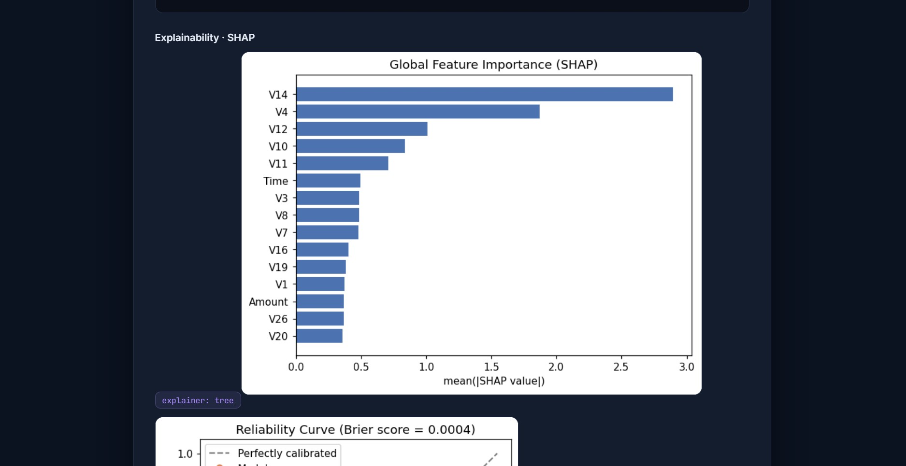
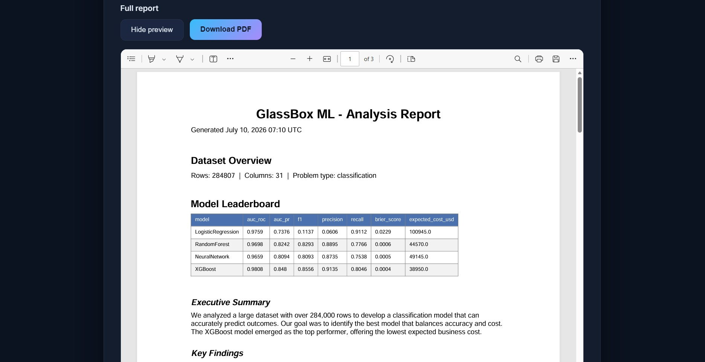

# GlassBox ML


> An end-to-end AutoML platform that turns any uploaded CSV into a cleaned, explained, deployment-ready model. It inspects data quality and flags leakage before modeling, selects the best model by business cost, explains predictions with SHAP, checks for drift, and writes an AI-generated PDF report. Built with FastAPI, React, XGBoost, and Groq LLaMA 3.3.

## Screenshots

**Data quality & leakage inspection — before any modeling**


**Upload — automatic problem-type detection and cleaning**


**Results — cost-aware model leaderboard with the winning model**


**Explainability — SHAP global feature importance**


**Report — auto-generated PDF with LLM business summary**


## Features

**Data Quality & Leakage Detection**
- Inspects the raw dataset before modeling and assigns a quality score (0-100)
- Flags target leakage (features suspiciously correlated with the target)
- Detects missing data, constant columns, duplicate rows, and high-cardinality ID columns
- Reports outliers and class-imbalance severity with actionable guidance

**Automated Preprocessing**
- Detects and fills missing values, encodes categoricals, scales numerics
- Automatic problem-type detection: classification, regression, or clustering
- Imbalance-aware stratified train/test split and stratified k-fold
- Computes scale_pos_weight for imbalanced datasets

**Cost-Aware AutoML**
- Trains up to five models: Logistic Regression, Random Forest, XGBoost, Neural Network, SVM
- Selects the winner by expected business cost, not just raw accuracy
- Recall-floor guardrail prevents a "predict nothing" degenerate model
- Human-readable decision log explaining why the winning model won

**Explainability**
- SHAP with adaptive explainer selection (Tree / Linear / Kernel)
- LIME cross-checks on individual predictions
- Calibration curves with Brier score
- Global feature importance ranking

**Drift Detection**
- Population Stability Index (PSI) per feature
- Kolmogorov-Smirnov test for distribution shift
- Flags stable, moderate, or significant drift

**Reporting**
- Groq LLaMA 3.3 generates a plain-English business report
- Downloadable PDF combining leaderboard, decision log, and charts
- Inline PDF preview inside the app

## Results on the Demo Dataset

Validated on the [Kaggle Credit Card Fraud dataset](https://www.kaggle.com/datasets/mlg-ulb/creditcardfraud) - 284,807 transactions with a 0.17% fraud rate. Winning model: XGBoost.

| Metric | Score |
|---|---|
| AUC-ROC | 0.981 |
| AUC-PR | 0.848 |
| Precision | 0.914 |
| Recall | 0.805 |
| F1 | 0.856 |

The cost-aware selector chose XGBoost over Logistic Regression despite comparable AUC-ROC, because Logistic Regression's low precision (0.06) produced a far higher expected business cost - a concrete demonstration of why metric choice matters on imbalanced data.

## Tech Stack

| Layer | Technology |
|---|---|
| Backend | Python, FastAPI, Uvicorn |
| ML & AI | Scikit-Learn, XGBoost, imbalanced-learn (SMOTE), SHAP, LIME, Groq LLaMA 3.3 |
| Reporting | ReportLab (PDF), Matplotlib |
| Data | MongoDB Atlas (optional persistence) |
| Frontend | React |
| Testing & CI | pytest, GitHub Actions |

## Project Structure

    glassbox-ml/
    |
    +-- backend/
    |   +-- main.py                 FastAPI app + REST endpoints
    |   +-- data_quality.py         Leakage + data-quality inspection
    |   +-- preprocessor.py         Cleaning, splitting, problem detection
    |   +-- model_selector.py       Cost-aware AutoML + decision log
    |   +-- explainer.py            SHAP / LIME / calibration
    |   +-- drift_detector.py       PSI + KS-test drift detection
    |   +-- reporter.py             Groq LLaMA report + PDF generation
    |   +-- db.py                   MongoDB Atlas persistence (optional)
    |
    +-- frontend/
    |   +-- public/index.html
    |   +-- src/
    |       +-- App.js              Stepper flow + layout
    |       +-- Upload.js           Upload, target select, data-quality panel
    |       +-- Dashboard.js        Cost config + training
    |       +-- Results.js          Leaderboard, SHAP, drift, PDF
    |       +-- api.js              API client
    |       +-- theme.js            Design tokens
    |
    +-- tests/
    |   +-- test_pipeline.py        pytest suite (14 tests)
    |
    +-- .github/workflows/tests.yml GitHub Actions CI
    +-- requirements.txt
    +-- Procfile
    +-- .env.example

## Setup & Installation

Clone the repository:

```
git clone https://github.com/Smit-Velani/glassbox-ml.git
cd glassbox-ml
```

Backend:

```
conda create -n idp python=3.11 -y
conda activate idp
pip install -r requirements.txt
cp .env.example .env
uvicorn backend.main:app --reload --port 8000
```

Interactive API docs: `http://127.0.0.1:8000/docs`

Frontend:

```
cd frontend
npm install
npm start
```

Open browser at: `http://localhost:3000`

Get free API keys:
- Groq: https://console.groq.com
- MongoDB Atlas (optional): https://www.mongodb.com/atlas

## Running Tests

```
pip install pytest
pytest -v
```

## API Endpoints

| Method | Endpoint | Description |
|---|---|---|
| POST | `/upload-dataset` | Upload a CSV |
| GET | `/data-quality/{job_id}` | Leakage + data-quality report |
| POST | `/preprocess` | Clean, split, and detect problem type |
| POST | `/train` | Cost-aware AutoML across models |
| GET | `/results/{job_id}` | Leaderboard and decision log |
| GET | `/explain/{job_id}` | SHAP importance and calibration |
| GET | `/detect-drift/{job_id}` | PSI / KS drift report |
| GET | `/report/{job_id}` | LLM-generated report text |
| GET | `/view-report/{job_id}` | PDF report (inline preview) |
| GET | `/download-report/{job_id}` | PDF report (download) |

## ML Design Decisions

**Leakage & Data-Quality Inspection**
- Flags features almost perfectly correlated with the target (classic leakage)
- Surfaces duplicates, constant columns, outliers, and imbalance before training
- Prevents "too good to be true" models caused by leaked signal

**Cost-Aware Model Selection**
- Converts each model's confusion matrix into an expected dollar cost
- Uses a business cost matrix (false-negative vs false-positive cost)
- Recall-floor guardrail disqualifies models below a minimum recall

**Leakage-Free SMOTE**
- SMOTE runs inside each cross-validation fold via an imblearn Pipeline
- Synthetic samples never touch held-out folds, preventing inflated metrics

**Adaptive SHAP Explainer**
- TreeExplainer for tree models, LinearExplainer for linear models
- Bounded KernelExplainer otherwise (KernelSHAP on 284K rows is impractical)

**Data-Size-Aware Speed Scaling**
- SMOTE and 5-fold CV on small data where they are cheap
- scale_pos_weight and 3-fold CV on large data - cut 284K-row training from ~20 min to ~3 min
- SVM auto-excluded above 20K rows due to O(n^2) complexity, logged explicitly

## Known Limitations

- In-memory job store - results are lost on server restart. A production version would persist to Redis or disk.
- No authentication layer.
- Not yet deployed to a public URL (runs locally).

## Author

**Smitkumar Velani**
MS Data Science - Northeastern University, Boston

[GitHub](https://github.com/Smit-Velani) | [LinkedIn](https://linkedin.com/in/smit-velani) | [Portfolio](https://smit-velani.github.io)

*Built with Python, FastAPI, React, XGBoost, SHAP, Groq LLaMA, Scikit-Learn*